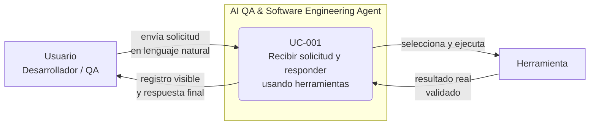

# UC-001 - Diagrama de Caso de Uso

Diagrama del caso de uso **UC-001 — El agente recibe una solicitud y responde
usando herramientas** (ver [UC-001](../UC-001.md)).

```mermaid
flowchart LR
    U["Usuario<br/>Desarrollador / QA"]

    subgraph S["AI QA & Software Engineering Agent"]
        direction TB
        UC1(UC-001<br/>Recibir solicitud y responder<br/>usando herramientas)
    end

    H["Herramienta"]

    U -- "envía solicitud<br/>en lenguaje natural" --> UC1
    UC1 -- "selecciona y ejecuta" --> H
    H -- "resultado real<br/>validado" --> UC1
    UC1 -- "registro visible<br/>y respuesta final" --> U
```
