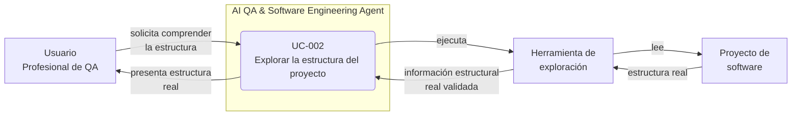

# UC-002 - Diagrama de Caso de Uso

Diagrama del caso de uso **UC-002 — El agente explora la estructura del
proyecto** (ver [UC-002](../UC-002.md)).

```mermaid
flowchart LR
    U["Usuario<br/>Profesional de QA"]

    subgraph S["AI QA & Software Engineering Agent"]
        direction TB
        UC2(UC-002<br/>Explorar la estructura del proyecto)
    end

    E["Herramienta de<br/>exploración"]
    P["Proyecto de<br/>software"]

    U -- "solicita comprender<br/>la estructura" --> UC2
    UC2 -- "ejecuta" --> E
    E -- "lee" --> P
    P -- "estructura real" --> E
    E -- "información estructural<br/>real validada" --> UC2
    UC2 -- "presenta estructura<br/>real" --> U
```
