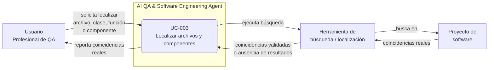

# UC-003 - Diagrama de Caso de Uso

Diagrama del caso de uso **UC-003 — El agente localiza archivos y componentes**
(ver [UC-003](../UC-003.md)).

```mermaid
flowchart LR
    U["Usuario<br/>Profesional de QA"]

    subgraph S["AI QA & Software Engineering Agent"]
        direction TB
        UC3(UC-003<br/>Localizar archivos y componentes)
    end

    B["Herramienta de<br/>búsqueda / localización"]
    P["Proyecto de<br/>software"]

    U -- "solicita localizar<br/>archivo, clase, función<br/>o componente" --> UC3
    UC3 -- "ejecuta búsqueda" --> B
    B -- "busca en" --> P
    P -- "coincidencias reales" --> B
    B -- "coincidencias validadas<br/>o ausencia de resultados" --> UC3
    UC3 -- "reporta coincidencias<br/>reales" --> U
```
