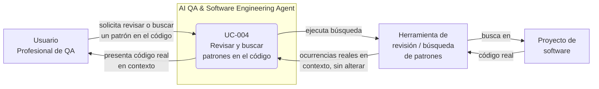

# UC-004 - Diagrama de Caso de Uso

Diagrama del caso de uso **UC-004 — El agente revisa y busca patrones en el
código** (ver [UC-004](../UC-004.md)).

```mermaid
flowchart LR
    U["Usuario<br/>Profesional de QA"]

    subgraph S["AI QA & Software Engineering Agent"]
        direction TB
        UC4(UC-004<br/>Revisar y buscar<br/>patrones en el código)
    end

    B["Herramienta de<br/>revisión / búsqueda<br/>de patrones"]
    P["Proyecto de<br/>software"]

    U -- "solicita revisar o buscar<br/>un patrón en el código" --> UC4
    UC4 -- "ejecuta búsqueda" --> B
    B -- "busca en" --> P
    P -- "código real" --> B
    B -- "ocurrencias reales en<br/>contexto, sin alterar" --> UC4
    UC4 -- "presenta código real<br/>en contexto" --> U
```
