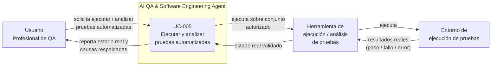

# UC-005 - Diagrama de Caso de Uso

Diagrama del caso de uso **UC-005 — El agente ejecuta y analiza pruebas
automatizadas** (ver [UC-005](../UC-005.md)).

```mermaid
flowchart LR
    U["Usuario<br/>Profesional de QA"]

    subgraph S["AI QA & Software Engineering Agent"]
        direction TB
        UC5(UC-005<br/>Ejecutar y analizar<br/>pruebas automatizadas)
    end

    H["Herramienta de<br/>ejecución / análisis<br/>de pruebas"]
    E["Entorno de<br/>ejecución de pruebas"]

    U -- "solicita ejecutar / analizar<br/>pruebas automatizadas" --> UC5
    UC5 -- "ejecuta sobre conjunto<br/>autorizado" --> H
    H -- "ejecuta" --> E
    E -- "resultados reales<br/>(paso / fallo / error)" --> H
    H -- "estado real validado" --> UC5
    UC5 -- "reporta estado real y<br/>causas respaldadas" --> U
```
