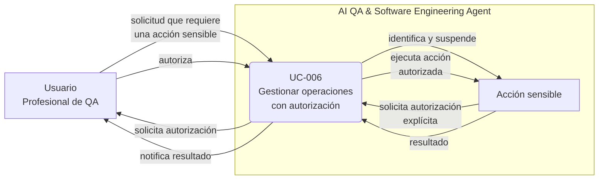

# UC-006 - Diagrama de Caso de Uso

Diagrama del caso de uso **UC-006 — El agente gestiona operaciones con
autorización (human-in-the-loop)** (ver [UC-006](../UC-006.md)).

```mermaid
flowchart LR
    U["Usuario<br/>Profesional de QA"]

    subgraph S["AI QA & Software Engineering Agent"]
        direction TB
        UC6(UC-006<br/>Gestionar operaciones<br/>con autorización)
        A[Acción sensible]
    end

    U -- "solicitud que requiere<br/>una acción sensible" --> UC6
    UC6 -- "identifica y suspende" --> A
    A -- "solicita autorización<br/>explícita" --> UC6
    UC6 -- "solicita autorización" --> U
    U -- "autoriza" --> UC6
    UC6 -- "ejecuta acción<br/>autorizada" --> A
    A -- "resultado" --> UC6
    UC6 -- "notifica resultado" --> U
```
