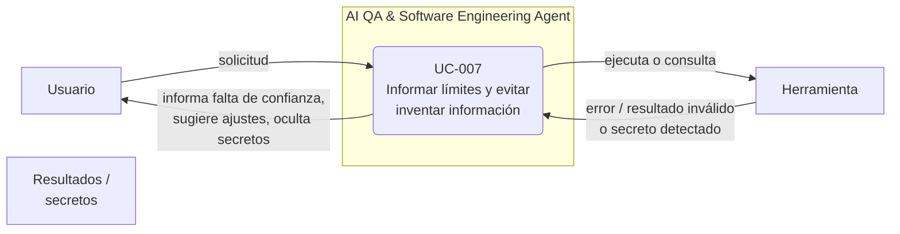

# UC-007 - Diagrama de Caso de Uso

Diagrama del caso de uso **UC-007 — El agente informa límites y evita inventar
información** (ver [UC-007](../UC-007.md)).

```mermaid
flowchart LR
    U["Usuario"]

    subgraph S["AI QA & Software Engineering Agent"]
        direction TB
        UC7(UC-007<br/>Informar límites y evitar<br/>inventar información)
    end

    H["Herramienta"]
    R["Resultados /<br/>secretos"]

    U -- "solicitud" --> UC7
    UC7 -- "ejecuta o consulta" --> H
    H -- "error / resultado inválido<br/>o secreto detectado" --> UC7
    UC7 -- "informa falta de confianza,<br/>sugiere ajustes, oculta secretos" --> U
```
