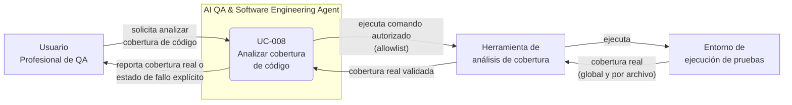

# UC-008 - Diagrama de Caso de Uso

Diagrama del caso de uso **UC-008 — El agente analiza la cobertura de código de
las pruebas** (ver [UC-008](../UC-008.md)).

```mermaid
flowchart LR
    U["Usuario<br/>Profesional de QA"]

    subgraph S["AI QA & Software Engineering Agent"]
        direction TB
        UC8(UC-008<br/>Analizar cobertura<br/>de código)
    end

    H["Herramienta de<br/>análisis de cobertura"]
    E["Entorno de<br/>ejecución de pruebas"]

    U -- "solicita analizar<br/>cobertura de código" --> UC8
    UC8 -- "ejecuta comando autorizado<br/>(allowlist)" --> H
    H -- "ejecuta" --> E
    E -- "cobertura real<br/>(global y por archivo)" --> H
    H -- "cobertura real validada" --> UC8
    UC8 -- "reporta cobertura real o<br/>estado de fallo explícito" --> U
```
