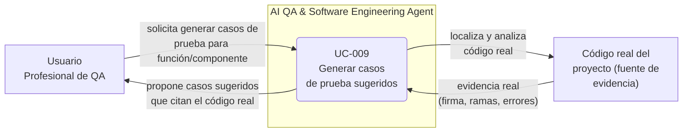

# UC-009 - Diagrama de Caso de Uso

Diagrama del caso de uso **UC-009 — El agente genera casos de prueba sugeridos**
(ver [UC-009](../UC-009.md)).

```mermaid
flowchart LR
    U["Usuario<br/>Profesional de QA"]

    subgraph S["AI QA & Software Engineering Agent"]
        direction TB
        UC9(UC-009<br/>Generar casos<br/>de prueba sugeridos)
    end

    C["Código real del<br/>proyecto (fuente de<br/>evidencia)"]

    U -- "solicita generar casos de<br/>prueba para función/componente" --> UC9
    UC9 -- "localiza y analiza<br/>código real" --> C
    C -- "evidencia real<br/>(firma, ramas, errores)" --> UC9
    UC9 -- "propone casos sugeridos<br/>que citan el código real" --> U
```
