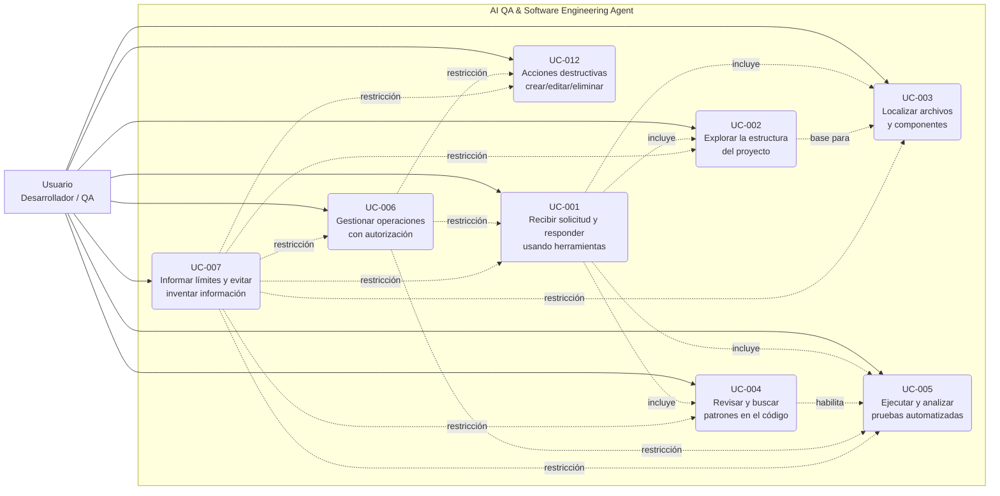

# Diagrama General de Casos de Uso

Diagrama a nivel de sistema de los casos de uso del **AI QA & Software
Engineering Agent**, mostrando los actores y sus interacciones con el sistema.

## Leyenda

- **Actor**: `U` — el usuario (desarrollador o profesional de QA) que inicia la
  interacción con el sistema.
- **Caso de uso**: nodos `UC-XXX` agrupados dentro del límite del sistema.
- **`includes`** (línea punteada): el caso de uso de destino forma parte del
  procesamiento del caso de uso origen como parte de su flujo.
- **`restricción`** (línea punteada): casos de uso transversales cuyas reglas
  condicionan al resto.
