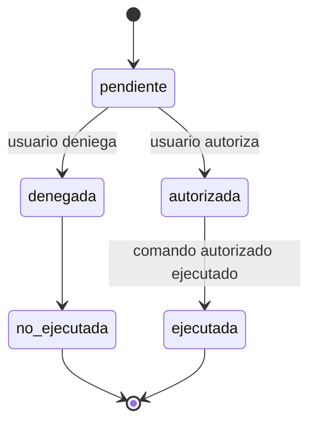
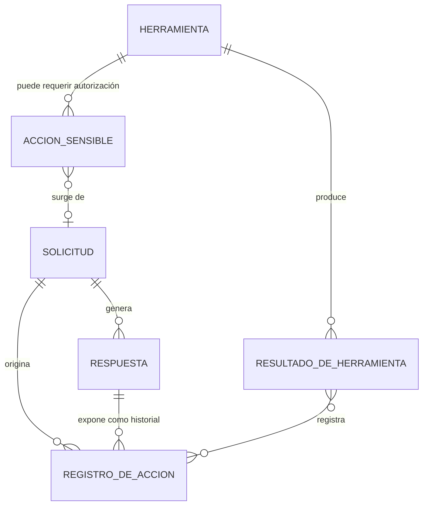
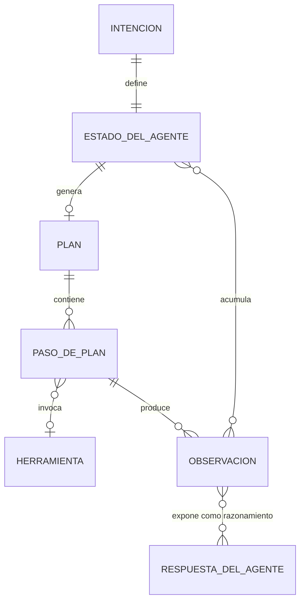
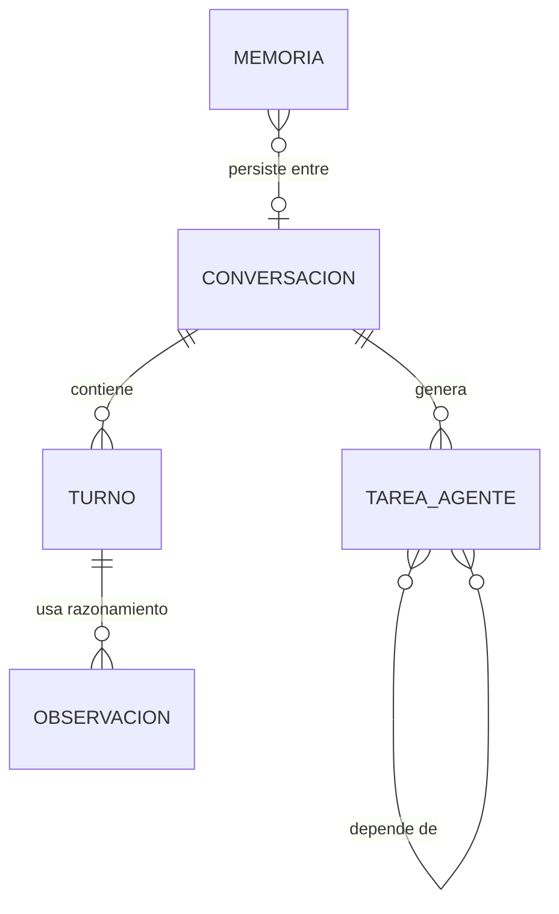

# Phase 1: Data Model — Core AI QA & Software Engineering Agent

Producción del `/speckit-plan` (Phase 1). Define las entidades, sus campos,
relaciones, reglas de validación y transiciones de estado que sustentan los
casos de uso. Está alineado con las "Key Entities" del spec y los principios de
validación/contratos (VII) y observabilidad (VIII).

> Convención de tipos: los campos se expresan con notación Python (`str`, `int`,
> `bool`, `list[T]`, `dict`) pero **sin decisiones de implementación definitivas**
> más allá de lo necesario (ver `contracts/`).

## Entidades

### 1. Solicitud

Expresión en lenguaje natural que inicia el flujo del agente.

| Campo | Tipo | Descripción |
|-------|------|-------------|
| `texto` | `str` | Texto de la solicitud del usuario. |
| `usuario` | `str` | Identificador/etiqueta del usuario que la emite. |
| `momento` | `datetime` | Marca de tiempo de recepción. |

**Reglas de validación**
- `texto` no vacío (FR-001). Sin texto válido → respuesta de error explícito.

**Transiciones**: `recibida` → `procesada` → `respondida` (ver `Respuesta`).

---

### 2. Herramienta

Capacidad ejecutable con un contrato definido de entrada y salida. No contiene
lógica del agente y no decide la continuación de la conversación (principio I).

| Campo | Tipo | Descripción |
|-------|------|-------------|
| `id` | `str` | Identificador único (`explore`, `locate`, `search`, `run_tests`). |
| `nombre` | `str` | Nombre legible para el LLM/trazabilidad. |
| `descripcion` | `str` | Descripción del contrato (qué hace, cuándo usarla) para la selección. |
| `esquema_entrada` | `JSON Schema` | Esquema validable de los parámetros de entrada. |
| `esquema_salida` | `JSON Schema` | Esquema validable de la estructura del resultado. |
| `requiere_autorizacion` | `bool` | Indica si la ejecución es una acción sensible (UC-006). |
| `rutas_permitidas` | `list[str]` | Rutas autorizadas (mínimo privilegio, FR-025). |

**Reglas de validación**
- Toda herramienta **debe** cumplir contrato de entrada/salida (VII); el agente
  valida el resultado antes de usarlo (FR-005).
- Nombres y esquemas validables e integrales (SC-006).

---

### 3. ResultadoDeHerramienta

Salida validable devuelta por una herramienta; fuente de verdad para el
razonamiento (principio IX).

| Campo | Tipo | Descripción |
|-------|------|-------------|
| `herramienta_id` | `str` | Identificador de la herramienta que lo produjo. |
| `estado` | `enum {exito, error, invalido}` | Estado de la ejecución (FR-018). |
| `datos` | `dict` | Datos reales devueltos (estructura según contrato). |
| `error` | `str?` | Mensaje de error, solo si `estado == error`. |
| `es_valido` | `bool` | ¿Pasó la validación del contrato? (FR-005, VII). |
| `momento` | `datetime` | Marca de tiempo. |

**Reglas de validación**
- Si `es_valido == false` o `estado != exito`, el agente **no** presenta el
  resultado como válido (FR-018, SC-005).
- Si contiene secretos detectados, se redactan antes de mostrarse (FR-021).

---

### 4. RespuestaDelAgente

Respuesta final hacia el usuario, basada en resultados reales obtenidos.

| Campo | Tipo | Descripción |
|-------|------|-------------|
| `texto` | `str` | Mensaje final para el usuario. |
| `solicitud_id` | `str` | Solicitud que originó la respuesta. |
| `acciones` | `list[RegistroDeAccion]` | Historial visible de acciones ejecutadas (FR-020). |
| `confianza` | `enum {alta, limitada, sin_informacion}` | Nivel de confianza (UC-007 / FR-017). |
| `basada_en_herramientas` | `bool` | Indica si se basó en resultados reales de herramientas. |

**Reglas de validación**
- `texto` no vacío para solicitudes válidas (SC-001).
- `acciones` incluye cada herramienta ejecutada y su resultado cuando la
  solicitud usó herramientas (SC-007).
- Si `confianza == sin_informacion`, no se inventa contenido (FR-017/019).

---

### 5. RegistroDeAccion

Entrada del historial visible: qué herramienta se usó y qué resultado se obtuvo
(observabilidad y trazabilidad, VIII / FR-020 / SC-007).

| Campo | Tipo | Descripción |
|-------|------|-------------|
| `orden` | `int` | Secuencia dentro de la conversación. |
| `herramienta_id` | `str` | Herramienta ejecutada. |
| `entrada` | `dict` | Parámetros usados (sin secretos). |
| `salida` | `dict` | Resultado obtenido (redactado de secretos). |
| `estado` | `enum {exito, error, invalido, pendiente_autorizacion}` | Estado de la acción. |

---

### 6. AccionSensible

Operación que puede modificar, eliminar o afectar información del proyecto y
requiere autorización explícita (UC-006 / FR-015).

| Campo | Tipo | Descripción |
|-------|------|-------------|
| `id` | `str` | Identificador único. |
| `descripcion` | `str` | Qué hará y qué información afecta. |
| `estado` | `enum {pendiente, autorizada, denegada, ejecutada, no_ejecutada}` | Estado de la autorización. |
| `herramienta_id` | `str` | Herramienta que la originaría. |

**Transiciones de estado** (UC-006)

**Reglas de validación**
- Toda acción sensible pasa por `pendiente` y requiere `autorizada` antes de
  ejecutarse (SC-004).
- Si `denegada`, la acción no se ejecuta y se notifica (FR-016).
- Mientras `pendiente`, la ejecución queda suspendida (FR-016, V).

---

### 7. Secretos (transversal)

Conjunto de patrones de detección para tokens, API keys y credenciales.

| Campo | Tipo | Descripción |
|-------|------|-------------|
| `patrones` | `list[regex]` | Patrones de detección (API keys, bearer tokens, etc.). |
| `valor_redactado` | `str` | Sustitución usada al ocultar (p. ej. `***`). |

**Regla transversal**: aplica a `ResultadoDeHerramienta`, `RegistroDeAccion`,
`RespuestaDelAgente` y a todos los logs (FR-021, SC-008, XI).

---

### 8. CasoDePrueba

Caso de prueba **sugerido** generado por la herramienta `generate_test_cases`
(ampliación QA/Testing).

| Campo | Tipo | Descripción |
|-------|------|-------------|
| `descripcion` | `str` | Qué verifica el caso. |
| `entrada_esperada` | `str` | Entrada propuesta. |
| `resultado_esperado` | `str` | Resultado esperado. |
| `tipo` | `enum {happy_path, edge_case, negativo}` | Tipo de caso. |
| `fuentes` | `list[str]` | Código real del proyecto citado como evidencia. |

**Reglas de validación**
- Los casos son **sugerencias** basadas en código real citado en `fuentes`
  (FR-019, IX). No se inventan fuentes inexistentes.
- La identificación de `fuentes` es determinista; solo la redacción del caso
  puede delegarse al LLM (VI).

---

### 9. CoverageReport

Reporte de cobertura de código producido por la herramienta `analyze_coverage`
(ampliación QA/Testing).

| Campo | Tipo | Descripción |
|-------|------|-------------|
| `cobertura_global` | `number` | Porcentaje global (0-100). |
| `por_archivo` | `list[ArchivoCobertura]` | Cobertura y líneas faltantes por archivo. |
| `estado` | `enum {exito, error, no_ejecutado}` | Estado del reporte. |

**ArchivoCobertura**: `ruta_relativa`, `cobertura`, `lineas_faltantes`.

**Reglas de validación**
- Reporta cobertura **real** de la ejecución (FR-019, SC-002).
- Si `estado == no_ejecutado`, se informa explícitamente (FR-017/018).

---

## Relaciones

## Mapeo a casos de uso

| Entidad | Casos de uso principales |
|---------|--------------------------|
| Solicitud | UC-001, UC-002, UC-003, UC-004, UC-005 |
| Herramienta | UC-001 a UC-005 |
| ResultadoDeHerramienta | UC-001 a UC-005, UC-007 |
| RespuestaDelAgente | UC-001 a UC-005, UC-007 |
| RegistroDeAccion | UC-001 (historial visible, FR-020) |
| AccionSensible | UC-006 |
| Secretos | UC-007 (todos por transversalidad) |

## Entidades QA/Testing (ampliación)

> Estas entidades sustentan las herramientas de ampliación QA/Testing
> (`analyze_test_results`, `generate_test_cases`, `analyze_coverage`), que se
> alinean con el dominio de QA del proyecto y se incorporan como componentes
> modulares (principio II), sin alterar las entidades del MVP.

| Entidad | Herramienta asociada | Notas |
|---------|----------------------|-------|
| `ResultadoDeHerramienta` (reutilizado) | `analyze_test_results` | Analiza la salida real de `run_tests`. |
| `CasoDePrueba` | `generate_test_cases` | Casos sugeridos basados en código real. |
| `CoverageReport` | `analyze_coverage` | Cobertura real por archivo. |

## Entidades de razonamiento-acción (ampliación agente)

> Sustentan el bucle percibir → pensar → actuar → observar → reflexionar →
> decidir (ver `agent-reasoning-loop.md`). Convierten el flujo de una sola
> pasada (chatbot) en un agente que planifica, itera y decide, manteniendo las
> garantías de honestidad (FR-019 / SC-002), autorización (SC-004) y allowlist
> (FR-025).

| Entidad | Campos clave | Propósito |
|---------|--------------|-----------|
| `Intencion` | `texto`, `objetivo`, `entidad`, `contexto` | Percepción: qué pide el usuario y sobre qué objeto real del proyecto. |
| `PasoDePlan` | `orden`, `razon`, `herramienta`, `parametros`, `criterio_salida` | Un paso pensado: por qué, qué herramienta, con qué argumentos, qué evidencia debe producir. |
| `Plan` | `objetivo`, `criterio_exito`, `pasos`, `pendientes` | Plan multi-paso explícito con criterio de éxito. |
| `Observacion` | `paso`, `resultado`, `evaluacion` | Resultado REAL de un paso ejecutado más la reflexión sobre su aporte. |
| `EstadoDelAgente` | `intencion`, `plan`, `observaciones`, `pasos_ejecutados`, `pasos_max`, `presupuesto_tokens` | Estado del ciclo: evidencia acumulada y límites de parada. |
| `RespuestaDelAgente` (ampliada) | `+ razonamiento: list[Observacion]` | Expone el razonamiento visible por pasos (FR-035 / SC-015). |

### Relaciones ampliadas

---

## Entidades conversacionales (Phase 13 / US-12)

> Sustentan el modo conversacional persistente: historial entre turnos,
> memoria de hechos/preferencias, gestión de tareas asignadas y persistencia
> de sesiones. Permiten que el agente sea un "chat agent" con continuidad,
> no solo un analizador QA single-shot.

| Entidad | Campos clave | Propósito |
|---------|--------------|-----------|
| `Conversacion` | `id`, `turnos: list[Turno]`, `resumen: str`, `hechos: dict[str, Any]`, `creada_en`, `actualizada_en` | Sesión completa de chat: historial, resumen evolutivo y hechos aprendidos. |
| `Turno` | `numero`, `usuario: str`, `agente: str`, `timestamp`, `herramientas_usadas: list[str]`, `razonamiento_ref: list[Observacion]` | Un intercambio usuario↔agente con evidencia del razonamiento usado. |
| `Memoria` | `hechos: dict[str, Any]`, `preferencias: dict[str, Any]`, `proyectos_conocidos: list[str]` | Memoria a largo plazo persistente entre sesiones. |
| `TareaAgente` | `id`, `titulo`, `descripcion`, `estado: enum {pendiente, en_progreso, completada, bloqueada}`, `prioridad`, `etiquetas`, `dependencias: list[id]`, `asignado_a`, `resultado: str`, `creada_en`, `actualizada_en` | Tarea asignable al agente o creada por él, con seguimiento de estado y resultado de ejecución. |

### Entidades de acciones destructivas (Phase 14 / US-13)

> Sustentan la modificación segura del proyecto (crear/editar/eliminar
> archivos): respaldo del estado previo antes de modificar/eliminar y
> verificación posterior basada en evidencia real (FR-042..047 / SC-021..024).

| Entidad | Campos clave | Propósito |
|---------|--------------|-----------|
| `Backup` | `id` (ruta en `.qa-backup/`), `ruta_relativa: str`, `contenido: str`, `creado_en` | Copia del estado original de un archivo antes de `editar_archivo`/`eliminar_archivo` (FR-045), restaurable vía `BackupManager.restaurar()`. |

### Relaciones conversacionales

